# AI architecture

Status: Phase 0 architecture baseline, 2026-09-07. This document specifies the Phase 7 Intelligence module and its later contextual features; it does not claim deployed models or evaluated accuracy. Authority: [master scope](../DEALITH_MASTER_PROJECT_SCOPE.md), §§3.5, 27–31, 49, 58–59 and 86. Related: [master architecture](MASTER_ARCHITECTURE.md), [data model](DATA_MODEL.md), [authorization](RBAC_ABAC_MATRIX.md), [repository integration](REPOSITORY_INTEGRATION.md), [data-room security](DATA_ROOM_SECURITY_MODEL.md).

## Authority and product contract

AI produces suggestions and explanations with evidence references. It has no transactional write tools, direct database access, generic HTTP tool, shell, credentials, or permission-management interface. It cannot approve verification or regulated eligibility, accept offers, sign, change a beneficiary, move money, release escrow, confer access or complete a diligence review. Text that suggests one of these actions remains text. A human must independently invoke the normal domain command with current authorization, validation and any required step-up or independent approval.

The initial gateway permits narrowly scoped read/query capabilities and artifact persistence only. A user can explicitly copy a suggested listing edit into a draft; saving it invokes Projects validation and cannot publish an unreviewed revision. Generated questions may be selected into a proposed diligence plan, but cannot silently add obligations to an active agreement. AI wording must not imply legal representation, security certification, ownership proof, guaranteed returns, or a verified fact unsupported by evidence.

| Capability | Allowed inputs and result | Availability / fallback |
|---|---|---|
| Listing Copilot | Owner-authorized structured draft; suggests summaries, category, missing fields and questions | Phase 7; normal wizard/readiness rules work without AI |
| Buyer/Investor Copilot | Each project's independently authorized projection; comparison, metric explanation and evidence gaps | Phase 7 after deterministic Phase 5 comparison; ordinary comparison remains available |
| Technical Copilot | Authorized `RepositoryAnalysis`, technical fields and reviewed evidence; explains findings and proposes diligence questions | Phase 7; never receives raw source through an implicit connection |
| Deal Copilot | Exact participant-authorized messages, offer references and permitted documents; cited summary of unresolved issues | Phase 9; no new access through conversation membership |
| Diligence Copilot | Permitted plan/tasks and evidence versions; suggests questions and explains recorded blockers | Phase 10; designated reviewer remains responsible for `DiligenceReview` |

Investment-related discovery uses the same eligibility and feature gates as the underlying listing. A model cannot enable a transaction family disabled by `DealTypePolicy`. Recommendations disclose the basis and confidence without predicting guaranteed commercial outcomes.

## Gateway and data flow

```mermaid
flowchart LR
  U[Authorized contextual request] --> A[API policy and budget reservation]
  A --> R[(AiRequest and durable outbox)]
  R --> W[Scoped Intelligence worker]
  W --> Q[Authorized domain query ports]
  Q --> D[Minimize and redact evidence]
  D --> G[AI Gateway and approved provider adapter]
  G --> V[Schema, evidence and policy validation]
  V --> S[(Restricted AiArtifact)]
  S --> P[Fresh authorization before delivery]
```

The provider-neutral gateway owns routing, immutable prompt templates, output schemas, input redaction, provider policy, budgets, rate limits, retries, timeouts, traces and evaluations. Domain application services decide which sources the actor may use; the gateway never broadens that scope. Provider adapters normalize completion, refusal, malformed output, rate limit, timeout, usage and unavailable-capability responses. No model or vendor version is frozen in Phase 0; each selected route and fallback is approved and evaluated before its owning phase enables it.

1. Resolve actor, represented principal, capability, resource IDs and source purpose on the server. Apply current policy and the capability flag. Accept an idempotency key; reserve a bounded budget atomically and commit `AiRequest` with audit/outbox. Return a request identifier for authorized polling.
2. At worker execution, recheck session/account eligibility as appropriate for the accepted job, current membership, grant, NDA, resource/version and provider-processing consent. Read through domain query ports. Expired or revoked scope cancels disclosure even if the request was previously accepted.
3. Build a typed source manifest containing exact resource/version references and permitted excerpts. Treat prompts from users, documents, repository text and messages as untrusted data. Bound source count, bytes, output tokens and processing time. Process only `CLEAN` document versions.
4. Minimize and redact before calling a permitted provider; record the route, prompt version, source manifest references, policy stamp and usage metadata. Provider calls are outside database transactions.
5. Validate output shape, length, citations and claim/evidence relationships. A citation must reference an input source/version accessible to the actor. Reject invented source IDs, forbidden actions, leaked secrets, unsupported verified labels and unsafe markup. Unsupported factual statements become explicit uncertainty or are withheld.
6. Recheck source policies before storing and again before delivering. Store an `AiArtifact` with the intersection of every source's audience restrictions, expiry and provenance. Do not stream unchecked confidential text to the client. A separate public-only streaming path requires equivalent output validation before release.

An artifact's classification is at least as restrictive as every input, but classification alone is insufficient: the viewer must be entitled to **all** contributing sources. Combining two individually restricted categories cannot produce a broadly visible summary. If a source expires or changes policy, the artifact becomes unavailable until safely recomputed; removing a citation from the display does not remove information embedded in the answer.

## Persistence, privacy and source isolation

| Canonical entity | Responsibility |
|---|---|
| `AiRequest` | Capability, actor/resource scope, `PromptVersion`, model/route version, permission stamp, budget reservation and execution outcome; minimized metadata rather than raw prompts by default |
| `AiArtifact` | Structured advisory result, uncertainty, source/version references, effective policy and expiry; immutable result lineage |
| `PromptVersion` | Reviewed immutable template, allowed source types, response schema and evaluation evidence |
| `AiEvaluation` | Dataset/version, provider/model/prompt route, safety/quality/cost results and release decision |
| `AiBudget` | Actor/organization/environment/capability ceilings with atomic reservation and actual usage accounting |
| `ProjectScore` | Projects-owned versioned score and components, confidence, evidence and computation time; Intelligence supplies advisory inputs through a port |

No raw KYC, payment credentials, signing secrets, provider tokens, reusable credentials or unrelated buyer/private team notes enter a general copilot. Restricted source-code processing requires separate named consent, source scope, current NDA/grant where applicable, and approved provider data terms. Repository authorization alone does not authorize sending source to an AI provider. Staff case evidence is excluded from customer copilots.

Before a route receives confidential data, verify provider processing purpose, training use, retention, deletion capability, geographic processing and subcontractor policy against the approved privacy contract. Do not assume an API offers zero retention. A route lacking the required terms is disabled for that classification; failover cannot change region, retention or permitted source type. Source owners receive a clear processing notice and the applicable opt-in; `ConsentRecord` history records explicit consent where required. Consent does not replace authorization or a lawful retention basis.

Logging contains request/trace identifiers, capability, safe error codes, latency, usage/cost and model/prompt versions. Default traces omit raw prompts, completions, document text, filenames and provider credentials. Temporary diagnostic capture needs a separately approved purpose, explicit scope, redaction, encrypted storage and bounded deletion; ordinary observability cannot become a second data room. Access to retained artifacts is audited.

Public semantic search, when enabled, embeds only approved `PUBLIC` listing fields. Confidential retrieval requires a separate policy-scoped corpus with document/version lineage, deletion and revocation support; it cannot query a shared public index. Cache keys include principal, represented organization, source versions, current policies, capability and prompt/model versions. No cross-tenant answer cache or training collection is permitted by default. Logout, member removal, grant revocation, NDA expiry and policy changes invalidate access independently of asynchronous cache cleanup.

## Reliability, scoring and human review

Reserve estimated maximum cost before dispatch, settle the reservation against reported usage, and track unknown provider usage conservatively until reconciled. Per-user, organization, environment and capability rate/budget limits apply together. Replayed requests do not dispatch again or reserve twice. Bounded retry/backoff is limited to approved transient failures; ambiguous provider acceptance is recorded so a retry's potential extra charge cannot be concealed. Exhausted budget gives a stable explanation and deterministic product fallback.

Provider timeouts or model refusal never change a project/deal/offer/settlement state. The UI reports unavailable analysis and preserves the user's normal workflow. Optional fallback requires the same classification, residency and evaluation approval. Cancellation prevents new work/result delivery; data already sent to a provider follows its contracted processing and deletion terms.

`ProjectScore` separates self-reported inputs, evidence-backed measures and model observations. Persist the score formula/policy version, component weights, missing-data handling and evidence confidence. Missing data reduces coverage rather than becoming a false zero or fabricated estimate. Scores from different policy versions are not directly comparable without disclosure. Recomputations and authorized manual corrections produce a new version with an audit reason; AI cannot award a verification badge. Public score components cannot depend on confidential inputs unless an explicitly approved safe disclosure has been created.

## Evaluation and phase gates

Phase 7 must version a synthetic/consented benchmark before enabling any route. Test prompt injection in documents/messages/repository text, cross-deal and cross-tenant leakage, revoked grants while queued, expired NDA before delivery, fabricated citations, conflicting metrics/periods, missing evidence, multilingual input, unsafe output markup and unsupported action requests. Each supported route and failover passes the same capability-specific suite.

Release requires zero successful unauthorized disclosure or transactional execution in the adversarial suite; all emitted citations must resolve to permitted input versions; zero unlabelled verified claims or fabricated material monetary values in the release set. Product/Intelligence owners define and record numeric task-quality, latency and cost thresholds in `AiEvaluation` before running the benchmark, report the full results and block launch on unmet thresholds. A finite test suite is evidence, not a guarantee of universal safety.

Online monitoring measures accepted/completed/refused requests, failures, budget use, latency, user feedback and evidence-validation rejection rates without content capture. A version change triggers offline regression, reviewed release and a feature-flagged rollout; rollback selects the previous approved route/template and does not rewrite old artifacts. Phase 9–10 rerun isolation and authority tests for each newly added source type. Phase 15 requires provider privacy evidence, incident/kill-switch drills and measured production-like behavior. See [test strategy](TEST_STRATEGY.md), [E2E matrix](E2E_TEST_MATRIX.md) and [phase acceptance matrix](PHASE_ACCEPTANCE_MATRIX.md).
