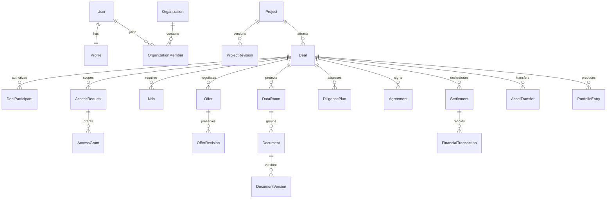

# Conceptual data model

Status: Phase 0 conceptual baseline with the Phase 1 operational projection extension in [ADR-017](adr/ADR-017-local-foundation.md). This catalog describes the full planned product; only four platform tables are implemented in Phase 1. Ownership follows [PRODUCT_DOMAIN_MAP.md](PRODUCT_DOMAIN_MAP.md). The master scope section 51 supplies the baseline; additional rows below close workflow, security, lineage and reliability requirements already present in that specification.

## Identity, keys and tenancy

Use opaque random UUID identifiers, UTC `timestamptz`, explicit lifecycle status types and optimistic aggregate `version`. A project owner is exactly one person or organization, represented by typed `ownerUserId`/`ownerOrganizationId` foreign keys with an XOR constraint. A `PartyRef` in this document means these typed columns or a typed join, never a freeform unchecked polymorphic ID. Staff identities use the same person record with separate staff audience/session and explicit scoped role assignment.

Organizations are collaboration tenants; individuals are valid principals without dummy organizations. A deal is a shared security boundary with two or more explicitly recorded principals. Do not set `Deal.organizationId` to one party and assume it controls all data. Each `DealParticipant` records principal, represented party, active membership/delegation, buyer/seller/advisor/legal capacity, scope, mandate, validity dates and explicit signatory authority. Organization administration alone does not grant access to every deal document. Removed members lose derived operational access immediately; immutable signer/actor history retains the identity at execution time.

Every child table carries the necessary parent/security-scope key; composite foreign keys or validated joins prevent attaching a foreign deal's folder, evidence, offer revision or participant to another deal. Global IDs never count as authorization. PostgreSQL row-level security is defense in depth for tenant/deal scopes; application RBAC/ABAC, explicit projections and request context remain required. Connection-pool context must be transaction-local and reset; background jobs carry an explicit service scope rather than bypassing tenant policy.

## Entity catalog

One row is one canonical conceptual entity. Embedded values such as address, Money, evidence label, item type and category enum are not additional entities. Projection rows and operational rows are explicitly labeled. Table names and physical indexes are finalized in the owning implementation phase with migration review.

| Entity | Owner | Key fields / purpose | Relationships and cardinality | Integrity / visibility |
|---|---|---|---|---|
| User | Identity | normalized email, password hash, account status, intents, securityVersion | 1:1 Profile; 1:N Session/MfaMethod; N:M Organization | Unique normalized email; security fields self/staff only; deletion cannot erase signed financial actor history |
| Profile | Identity | display/professional name, bio, location, links, thesis, visibility | Exactly 1 User; optional public organization references | Canonical name for master `UserProfile`; safe public DTO separate from private preferences |
| Session | Identity | token hash, audience, expiry, lastSeen, revokedAt, assurance, device metadata | N:1 User | Opaque token stored only hashed; separate web/admin audience; revocation authoritative in DB |
| MfaMethod | Identity | method type, credential identifier, encrypted TOTP seed or WebAuthn public key, counter, confirmedAt | N:1 User | TOTP secrets encrypted; WebAuthn private key never held by platform |
| AuthChallenge | Identity | purpose, token hash, expiry, consumedAt, attempt counter | N:1 User or pending registration identifier | Single-use email/reset/recovery/invitation proof; purpose-bound; hashed token |
| RecoveryCode | Identity | code hash, usedAt | N:1 User | Single use; only issuance plaintext; never logged |
| FederatedIdentity | Identity | issuer, subject, organization policy binding | N:1 User; optional N:1 Organization | Unique issuer/subject; Phase 14 OIDC; verified linking prevents account takeover |
| Organization | Organizations | legal/public name, owner reference, jurisdiction, status, security policy | 1:N OrganizationMember/Invitation; 1:N owned Project | Legal identity separated from public profile; last active owner invariant |
| OrganizationMember | Organizations | organizationId, userId, scoped roles, status, joinedAt/revokedAt | N:1 Organization and User | Unique active organization/user membership; revocation increments policy version |
| Invitation | Organizations | inviter, normalized recipient, role proposal, token hash, expiry, acceptedAt | N:1 Organization; accepted User optional | Canonical master `OrganizationInvitation`; membership created atomically on one-time acceptance |
| RoleAssignment | Authorization | subject, role, organization/resource scope, grantor, expiry | N:1 User; optional Organization/Deal scope | Broad capability only; no owner/deal/NDA implication; privileged assignment audited |
| PolicyBinding | Authorization | resource type, typed resource FK, policy key/version, field/category selector | N:1 owned resource; binds principal/context constraints | Allowed resource-type/FK combinations constrained; deny overrides; no arbitrary executable policy |
| ConsentRecord | Privacy | subject, purpose, policy version, granted/revokedAt | N:1 User/Organization representative | Immutable consent history; no marketing consent inferred from transaction access |
| PrivacyRequest | Privacy | requester, export/delete type, status, legal exemption references | N:1 User; optional ComplianceCase/LegalHold | Reauthentication; sanitized export; retain minimum legally required transaction evidence |
| Verification | Verification | subject, type, status, provider ref, reviewer, reason, expiry, completedAt | N:1 User/Organization/Project typed subject; 1:N VerificationEvidence | Canonical statuses from master; successful email proof is not ownership/KYC approval |
| VerificationEvidence | Verification | verificationId, source/type, claim, issuer, capturedAt, hash | N:1 Verification; optional DocumentVersion/RepositoryAnalysis | Immutable provenance; KYC PLATFORM_ONLY; raw provider evidence minimized |
| ProjectVerification | Verification | projectId, verificationId, coverage and validity | N:1 Project and Verification | Unique project/verification/coverage; cross-subject verification cannot be borrowed |
| Project | Projects | owner, slug, assetType, stage, listing status, currentRevisionId, publishedRevisionId, version | 1:N ProjectRevision/Deal/ProjectEvent; 1:N transaction options | 17 canonical listing states; state commands only; stable slug redirects; ownership changes audited |
| ProjectReservation | Projects | projectId, dealId, acceptedOfferRevisionId, rights scope, exclusivity, status/version, disposition | N:1 Project, Deal and OfferRevision | Unique conflicting active exclusive rights; atomic acceptance/release through owner services; paused/suspended listing cannot evade reservation |
| ProjectRevision | Projects | projectId, sequence, editor, content hash, completeness, review outcome | N:1 Project; snapshot owns profile/section versions | Unique project/sequence; submitted/approved snapshots immutable; pending edits never overwrite public approved snapshot |
| ProjectEvent | Projects | projectId, from/to state, command, actor, reason, expectedVersion, revisionId | N:1 Project and ProjectRevision | Append-only listing transition/history; audit/outbox atomic with state write |
| ProjectProfile | Projects | problem, audience, solution, differentiation, market, business model, risks | N:1 ProjectRevision; exactly one profile per revision | Field classifications explicit; sanitized narrative; public projection generated from approved version |
| Category | Marketplace | slug, name, parentId, allowed asset types, active | 0..1 parent Category; 1:N child Category; N:M Project via ProjectCategory | Acyclic tree; deprecated taxonomy remains resolvable historically |
| ProjectCategory | Projects | projectRevisionId, categoryId, primary flag | N:1 ProjectRevision and Category | Canonical listing/category join; exactly one primary category for publication |
| ProjectCapability | Projects | name, category, description, maturity, proof reference | N:1 ProjectRevision; optional DocumentVersion/ProjectPreview | Proof is separately authorized; claims do not imply verified capability |
| ProjectPreview | Projects | mode, external URL or object ref, caption, accessibility text, review/scan state | N:1 ProjectRevision; optional sanitized DocumentVersion | Enumerated showcase modes; no arbitrary deployment; public copy only after publication |
| ProjectTechnology | Projects | component type, technology, purpose, disclosed version, provenance | N:1 ProjectRevision | Safe stack public; sensitive configuration omitted; structured allowlists |
| ProjectMetric | Projects | metric key, decimal value/unit, period, evidence class, source, observedAt | N:1 ProjectRevision; optional VerificationEvidence/DocumentVersion | Unknown is null + reason; immutable published periods; ratio/unit validation |
| ProjectFinancial | Projects | measure, Money, accounting basis, period, source, publishable band | N:1 ProjectRevision; evidence references | Exact values APPROVED_BUYER minimum; no floats; band derived/approved separately |
| ProjectArchitecture | Projects | safe summary, topology description, diagram version ref, classification | N:1 ProjectRevision; optional DocumentVersion | Detailed infrastructure/source may be RESTRICTED_DILIGENCE; diagrams sanitized |
| ProjectScore | Projects | score version, component values, confidence, evidence links, computedAt | N:1 Project; optional RepositoryAnalysis/AiArtifact | Historical score immutable; score inputs/policy visible where allowed; override is audited new version |
| ProjectTransactionOption | Projects | dealType, asking Money, included/excluded assets, transition support, eligibility | N:1 ProjectRevision; N:1 DealTypePolicy version | Disabled policies cannot activate transaction; supported rights/exclusivity explicit |
| ProjectTeamMember | Projects | public role/headcount, person reference optional, consent state, transition availability | N:1 ProjectRevision; optional User | Customer/employee names not implicitly public; consent and owner authority required |
| RepositoryConnection | Intelligence | provider, installation/account/repository IDs, scoped consent, allowed level, revocation/version | N:1 Project; authorized connecting User/Organization | No source token in API DTO; credentials held in secret store; least repository permissions |
| RepositoryAnalysis | Intelligence | connectionId, commit hash, analyzer version, source scope, derived signals, confidence, expiry | N:1 RepositoryConnection; 1:N evidence references | Immutable snapshot; derived signals do not imply IP ownership; no raw source in public result |
| RepositoryAccessGrant | Intelligence | connectionId, dealParticipantId, scope, owner approval, NDA ref, expiry, revocation evidence | N:1 RepositoryConnection and DealParticipant | Level 4 separate explicit grant; external revocation tracked; failure blocks/reviews continued access |
| SearchProjection | Search | projectId, publishedRevisionId, safe tokens/facets, ranking version, eligibility stamp | 0..1 current projection per Project | Rebuildable public-only read model; removal/eligibility checks prevent stale private exposure |
| SearchIndexCheckpoint | Search | consumer/index version, last event sequence, rebuild state | N:1 projection generation | Operational replay watermark; never business truth |
| Watchlist | Marketplace | owner PartyRef, name, visibility, collaborator policy | 1:N WatchlistItem | Personal default; explicit team sharing via PolicyBinding; seller cannot inspect buyer collections |
| WatchlistItem | Marketplace | watchlistId, projectId, tags, private note | N:1 Watchlist and Project | Unique list/project; deletion of public listing yields unavailable placeholder without extra rights |
| SavedSearch | Search | owner, versioned filter AST, notification cadence, enabled, lastCheckpoint | N:1 owner; optional organization scope | Structured query validation; no raw SQL/query DSL injection; current permissions on every match |
| DealCart | Deal Cart | owner PartyRef, name, purpose, version | 1:N DealCartItem/DealCartCollaborator/DealCartNote | Evaluation workspace only; no monetary checkout state |
| DealCartItem | Deal Cart | cartId, projectId, intended dealType, addedAt, evaluation status | N:1 DealCart/Project; optional initiated Deal ref | Unique cart/project/intended type; snapshot does not authorize confidential information |
| DealCartNote | Deal Cart | cartId, optional itemId, author, text, visibility | N:1 DealCart; optional DealCartItem; N:1 User | Author-private or explicit team scope; not propagated into seller deal messages |
| DealCartCollaborator | Deal Cart | cartId, user/memberId, evaluator/editor scope, expiry | N:1 DealCart and User/OrganizationMember | Explicit grant; removal revokes access; org admin role alone not blanket access |
| AccessRequest | Access | projectId, dealId, requester/represented party, purpose, intended type, categories, status | N:1 Project/Deal; 1:N AccessDecision/AccessGrant | Requester must be DealParticipant; one active equivalent request; no grant implied by pending request |
| AccessDecision | Access | requestId, actor, approved/rejected categories, reason, NDA requirement, expiry | N:1 AccessRequest | Immutable decision history; partial decisions explicit; rescopes produce new decision |
| AccessGrant | Access | request/decisionId, dealParticipantId, category scope, validity, ndaVersionId, revocation | N:1 AccessRequest/AccessDecision/DealParticipant | Current subject membership + classification + NDA still checked; revoked grants never resurrected by event replay |
| Nda | NDA | dealId, required parties, scope, currentVersionId, status, expiresAt | N:1 Deal; 1:N NdaVersion/NdaSigner | NOT_REQUIRED, REQUIRED, SENT, VIEWED, SIGNED, DECLINED, EXPIRED, VOIDED; exact scope not global account badge |
| NdaVersion | NDA | ndaId, sequence, DocumentVersion ref/hash, terms, provider envelope ref | N:1 Nda; 1:N NdaSigner | Issued versions immutable; new version invalidates old access linkage until required signature proof exists |
| NdaSigner | NDA | ndaVersionId, participant, authority snapshot, routing order, signature status/evidence | N:1 NdaVersion and DealParticipant | All required signers on same version; verified provider event; name/email click is insufficient |
| Conversation | Messaging | projectId, dealId optional only for general inquiry, scope, retention, status | 1:N Participant/Message | Deal-confidential conversation always dealId-bound; general inquiry limited to public/self-disclosed content |
| Participant | Messaging | conversationId, userId, represented party, scope, active dates | N:1 Conversation/User; optional DealParticipant | Canonical master `ConversationParticipant`; uniqueness by conversation/user/capacity; revocation enforced |
| Message | Messaging | conversationId, senderId, body, createdAt, edited/redacted reference, system event ref | N:1 Conversation/Participant; 1:N MessageAttachment/MessageReceipt | Immutable original with revision/redaction audit; system legal state sourced only from structured domain events |
| MessageReceipt | Messaging | messageId, participantId, deliveredAt/readAt | N:1 Message/Participant | Unique message/participant; no cross-thread receipt enumeration |
| MessageAttachment | Messaging | messageId, documentVersionId | N:1 Message and DocumentVersion | Attachment access requires both conversation and document authorization; no raw public S3 URLs |
| ConversationBlock | Messaging | blocking principal, blocked principal, conversation/project scope, reason | N:1 actor/target User; optional Conversation | Cannot erase legally retained evidence; block prevents new interaction subject to operations workflow |
| Deal | Deals | projectId, buyer/seller parties, dealTypePolicy version, status, version, acceptedOfferRevisionId, dates | N:1 Project; 1:N DealParticipant/DealEvent; 1:N Offers; 0..1 active settlement/transfer | 28 canonical states; authoritative stage and immutable transition evidence; active exclusivity reservation enforced |
| DealParticipant | Deals | dealId, principal, represented party, role/capacity, mandate, authority, active dates | N:1 Deal; N:1 User and optional OrganizationMember | Cross-tenant participation explicit; actor cannot claim arbitrary represented organization |
| DealEvent | Deals | dealId, from/to, actor/service, reason, commandId, versions, referenced evidence | N:1 Deal | Append-only transition/timeline fact, atomic audit/outbox; stage never freeform string update |
| DealTypePolicy | Deals | type/version, eligible jurisdictions, participants, NDA/LOI/diligence/agreement/settlement/transfer requirements | 1:N ProjectTransactionOption/Deal snapshots | Immutable active version; published capability matrix; unsupported policy disabled; investments default off |
| DealDispute | Deals | dealId, raisedBy, disputed state snapshot, category, evidence, resolution, provider case ref | N:1 Deal; optional ComplianceCase; references protected evidence | Opening pauses release/transfer as applicable; resolution append-only; staff cannot fabricate provider outcome |
| Offer | Offers | dealId, proposer/recipient parties, currentRevisionId, status, version | N:1 Deal; 1:N OfferRevision/OfferDecision | One negotiation chain; accepted revision unique per exclusive active deal; view state distinct from acceptance |
| OfferRevision | Offers | offerId, sequence, parentRevisionId, author, Money, type, deposit, structure, conditions, expiry | N:1 Offer; parent within same Offer; 1:N OfferDecision | Submitted revision immutable; counter creates child; exact current revision acceptance; decimal amounts |
| OfferDecision | Offers | offerRevisionId, action, actor/capacity, timestamp, reason, commandId | N:1 OfferRevision | Immutable submission/view/counter/accept/reject/withdraw/expire history; one decisive acceptance per revision |
| LetterOfIntent | Offers | dealId, acceptedOfferRevisionId, required flag, status, currentVersionId | N:1 Deal/OfferRevision; 1:N LetterOfIntentVersion | LOI status separate from Deal stage; waiver needs DealTypePolicy authorization and audit |
| LetterOfIntentVersion | Offers | loiId, sequence, documentVersionId/hash, binding-clause metadata, provider envelope | N:1 LetterOfIntent; 1:N LetterOfIntentSigner | Issued versions immutable; offer alignment captured; no new funding authorization |
| LetterOfIntentSigner | Offers | loiVersionId, participant, authority, status, proof | N:1 LetterOfIntentVersion/DealParticipant | All policy-required parties sign exact version; provider verified evidence |
| DataRoom | Data Room | projectId, dealId, owner PartyRef, status, policyVersion | N:1 Project and Deal; 1:N DataRoomFolder/ViewerGroup/Document | One deal's room cannot be enumerated by another deal on same listing; copied docs require explicit policy |
| DataRoomFolder | Data Room | roomId, parentId, category, label, policy reference | N:1 DataRoom; optional parent within same room | Acyclic; depth bounds; inherited policy may restrict, never silently elevate classification |
| ViewerGroup | Data Room | roomId, name, purpose, validity | N:1 DataRoom; 1:N ViewerGroupMember | Groups scoped to room/deal; seller counsel and buyer team distinct |
| ViewerGroupMember | Data Room | groupId, dealParticipantId, addedBy, expiry/revocation | N:1 ViewerGroup/DealParticipant | Participant must belong to same deal; removal invalidates delivery policy |
| Document | Documents | owner, purpose, roomId/folderId optional, classification, currentVersionId, retentionPolicyId | 1:N DocumentVersion/DocumentAccessPolicy/DocumentAccessEvent | Private default; typed purpose covers preview/KYC/NDA/agreement/diligence/transfer; logical archive not physical purge |
| DocumentVersion | Documents | documentId, sequence, object key/version, size, MIME, hash, uploader, malware state, scan engine/version | N:1 Document; referenced by legal/evidence rows | Unique immutable object version; clean before access; immutable signed copies; new bytes always new row |
| DocumentAccessPolicy | Documents | documentId, optional version, allowed groups/categories, NDA, download, watermark, expiry, policyVersion | N:1 Document; optional ViewerGroup/PolicyBinding | Deny precedence; expiry/hold/classification; no public confidential-object ACL |
| DocumentAccessEvent | Documents | document/versionId, actor, action/result, requestId, grant context, issued capability reference | N:1 Document/DocumentVersion; optional DealParticipant | Append-only issued/view/download/denied audit; distinguish URL issued from actual delivery evidence |
| RetentionPolicy | Documents | record class, version, minimum/maximum periods, jurisdiction/purpose, purge authority | 1:N Document and archival records | Approved policy before launch; no single universal deletion period; legal hold takes precedence |
| LegalHold | Documents | scope, authority/case, imposedAt, releasedAt, reason | Typed scope to Document/Deal/User records; optional ComplianceCase | Blocks purge, does not grant access; release needs authorized review; immutable hold history |
| DiligenceTemplate | Diligence | version, asset/deal type, categories, required tasks, review/waiver policy | 1:N DiligencePlan snapshots | Approved version immutable once used; 13 canonical categories |
| DiligencePlan | Diligence | dealId, template/version, required tasks snapshot, status, completedAt | N:1 Deal; 1:N DiligenceTask | Completed only when deterministic requirements and reviews pass; late material evidence reopens review |
| DiligenceTask | Diligence | planId, category, title, assignee, reviewer, state, due date, risk, blockers | N:1 DiligencePlan; 1:N evidence/comments/reviews | 10 master task statuses; reviewer independence for mandatory high-risk items; same-deal assignees |
| DiligenceEvidence | Diligence | taskId, submitter, documentVersionId or typed verification ref, submittedAt | N:1 DiligenceTask; N:1 evidence source | Immutable submitted evidence, not mutable URL; version/classification follows source |
| DiligenceComment | Diligence | taskId, author, body, visibility, revision reference | N:1 DiligenceTask/DealParticipant | Scoped thread; no reusable secrets; edits retain audit |
| DiligenceReview | Diligence | taskId, reviewer, evidence snapshot, result, reason, waiver authority, createdAt | N:1 DiligenceTask; references exact DiligenceEvidence set | Append-only decision; waiver cannot bypass regulatory/provider/ownership prohibitions |
| Agreement | Agreements | dealId, type, currentVersionId, status, policyVersion | N:1 Deal; 1:N AgreementVersion/AgreementSigner | Only complete required agreement set can unlock settlement |
| AgreementVersion | Agreements | agreementId, sequence, documentVersionId/hash, offerRevisionId, approval snapshot, provider envelope | N:1 Agreement; 1:N AgreementSigner | Immutable after sent; changes void/supersede previous package; exact terms/currency/destination references pinned |
| AgreementSigner | Agreements | agreementVersionId, participant, authority snapshot, routing order, status/proof | N:1 AgreementVersion/DealParticipant | All required current-version signers; provider receipts validated and deduplicated |
| SettlementParticipant | Settlement | party, provider/account/environment, provider participant ref, verification/capability state | N:1 User/Organization; 1:N Settlement role references | Provider owns onboarding/payment credentials; application stores safe references and evidence status |
| Settlement | Settlement | dealId, provider/account/environment, rail/currency, expected Money, agreement version, status/version, destination fingerprint | N:1 Deal; 0..1 Escrow per active attempt; 1:N milestones/operations/transactions | Provider-managed escrow V1; one active funded attempt; immutable authorized destination version; sandbox/live separated |
| Escrow | Settlement | settlementId, provider escrow ref, confirmed funded/released/refunded totals, provider status | N:1 Settlement | Unique provider/account/environment/reference; provider confirmation required; totals derived from journal evidence |
| SettlementMilestone | Settlement | settlementId, sequence, Money, release conditions, accepted evidence, status | N:1 Settlement; optional AssetTransferItem refs | Amount sum/release ceiling enforced; V1 may use one milestone; no partial provider capability assumption |
| SettlementDestination | Settlement | settlementId, version, provider beneficiary reference, verification state, fingerprint | N:1 Settlement and SettlementParticipant; referenced by ProviderOperation | Immutable destination version; no raw banking credentials; replacement invalidates outstanding approvals |
| SettlementApproval | Settlement | operationId, actor/capacity, agreement/destination/request hashes, step-up proof, validity | N:1 ProviderOperation, SettlementDestination and AgreementVersion | Exact instruction binding; distinct authorized approvers; expired or changed scope cannot authorize execution |
| FinancialTransaction | Settlement | settlementId, provider movement ref, kind, Money, postedAt, evidence hash, reversalOfId | N:1 Settlement; optional prior transaction reversal | Immutable operational journal, not custody ledger; unique provider/account/environment/movement; corrections compensating only |
| ProviderEvent | Settlement | provider/account/environment/eventId, signature result, raw hash/encrypted evidence ref, receivedAt, normalized type, status | Optional N:1 Settlement; processing refs | Durable inbox; unique provider/account/environment/eventId; immutable received payload; unknown reference quarantined |
| ProviderOperation | Settlement | settlementId, provider/account/environment, operation kind, idempotency key, request hash, state, attempt count, provider ref, deadline | N:1 Settlement; optional SettlementMilestone and SettlementDestination; 1:N SettlementApproval | Durable command intent before network; stable provider/account/environment/key; same key/different payload rejected; unknown outcome reconciled before retry |
| ReconciliationRun | Settlement | provider/account/environment, coverage cursor, start/end, discrepancies, resolution refs | N:M Settlement via result references; 1:N ReconciliationDiscrepancy | Periodic and event-triggered; open mismatch blocks release/completion; read-only provider truth comparison |
| ReconciliationDiscrepancy | Settlement | runId, settlementId, expected/observed evidence, category, assigned case, resolution history | N:1 ReconciliationRun and Settlement; optional ProviderOperation/ComplianceCase | No destructive correction; unresolved money differences block conflicting operations; resolution links authoritative provider evidence |
| AssetTransfer | Asset Transfer | dealId, agreement version, policy/checklist version, state, inspection window | N:1 Deal; 1:N AssetTransferItem | Created from agreed included/excluded assets; completed only through recipient confirmations and policy |
| AssetTransferItem | Asset Transfer | transferId, type, owner/recipient, due date, state, provider reference, confirmation, dispute marker | N:1 AssetTransfer; 1:N AssetTransferEvidence | No reusable credentials; acceptance bound to intended recipient and evidence; optional/required explicit |
| AssetTransferEvidence | Asset Transfer | itemId, submittedBy, documentVersionId/provider proof, hash, observation/acceptance timestamps | N:1 AssetTransferItem; source references | Append-only provider/counsel/recipient evidence; access follows document/transfer policy |
| PortfolioEntry | Portfolio | completedDealId, holder PartyRef, role, rights snapshot, price, completion date, retained rights | N:1 Deal and holder; 1:N PortfolioMetric/PortfolioNote | Unique deal/holder/rights type; created idempotently after CLOSED; never assumes every deal transfers whole project |
| PortfolioMetric | Portfolio | entryId, measure, period, Money/unit, source and evidence class | N:1 PortfolioEntry | Holder-supplied tracking distinct from original verified sale metrics; protected team scope |
| PortfolioNote | Portfolio | entryId, author, body, visibility | N:1 PortfolioEntry/User | Private or authorized portfolio team; no spillover to former counterparty |
| Review | Reputation | completedDealId, reviewer/reviewee, currentRevisionId, status | N:1 Deal; 1:N ReviewRevision | Unique eligible relationship/reviewer; no self-review; moderation does not rewrite original evidence |
| ReviewRevision | Reputation | reviewId, sequence, score/text, author, reason, createdAt | N:1 Review | Append-only edits/moderation history; protected content sanitized before publication |
| ReputationScore | Reputation | subject, score version/components, confidence, input refs, computedAt | N:1 User/Organization; references eligible facts | Versioned derived projection; paid plan never changes verification truth |
| Plan | Billing | code, version, price Money, interval, quotas, entitlements, active | 1:N Subscription | Published plan versions immutable for existing contracts; public safe catalog |
| Subscription | Billing | owner PartyRef, planVersion, provider/account/environment ref, status, period, cancellation | N:1 Plan; 1:N Invoice/EntitlementGrant | Provider-confirmed billing lifecycle; distinct from settlement; one active subscription per product scope |
| BillingCustomer | Billing | owner, billing provider/account/environment/customer ref, tax metadata reference | N:1 User/Organization | Provider payment method references only; payer restricted; no full credentials |
| Invoice | Billing | subscription/customerId, number, period, line snapshot, totals/tax Money, provider ref, status | N:1 Subscription/BillingCustomer | Immutable issued amounts; corrections credit/adjustment references; billing data private |
| EntitlementGrant | Billing | owner, feature/quota, source subscription, validity, policy version | N:1 Subscription or approved administrative grant | Capability/quota only; cannot override RBAC/ABAC/legal block; expiration safe for retained records |
| Notification | Notifications | recipient, eventId/type, template version, safe parameters, readAt | N:1 User; 1:N NotificationDelivery | Unique recipient/event/template purpose; no confidential content in email/push payload |
| NotificationPreference | Notifications | userId, event family, channel, frequency, enabled | N:1 User | Unique user/family/channel; mandatory security/financial categories preserved |
| NotificationDelivery | Notifications | notificationId, channel, provider ref, attempt/status, sentAt, bounce class | N:1 Notification | Idempotent delivery key; bounded retry; no private rendered body in generic logs |
| ComplianceCase | Compliance | subject/deal/settlement, case type, jurisdiction, assignee, status, decision/hold refs | 1:N ComplianceEvidence/RiskDecision; typed subject refs | Analyst assignment + purpose; sensitivity PLATFORM_ONLY; adverse actions appeal/review trace |
| ComplianceEvidence | Compliance | caseId, provider/document version ref, provenance, classification | N:1 ComplianceCase | Immutable linked evidence; KYC/legal restrictions survive general document permission |
| RiskAlert | Risk | subject/action, rule/model version, score/severity, evidence refs, status | Optional N:1 ComplianceCase/Deal/Settlement | Signals do not directly become legal conclusion; actionable deterministic rule recorded |
| RiskDecision | Compliance | case/action scope, ALLOW/BLOCK/REVIEW, rule version, actor, reason, validity, approval | N:1 ComplianceCase or scoped risk action | Append-only effective decision history; fresh check for sensitive command; unblocks separately approved |
| AnalyticsEvent | Analytics | event name/version, pseudonymous actor, permitted dimensions, consent basis, eventAt | Optional safe Project/Deal refs | No raw messages/KYC/exact financials; retention limited; not authoritative audit |
| AnalyticsAggregate | Analytics | metric/dimension window, count/value, policy/version, refreshAt | Derived from AnalyticsEvent/domain-safe counters | Suppress small cohorts; rebuildable; organization/owner-scoped queries |
| AiRequest | Intelligence | capability, actor/resource scope, prompt/model versions, budget reservation, status, source permission stamp | 1:N AiArtifact; N:1 PromptVersion | Store minimized metadata; no raw prompt/source by default; authorization recheck at execution and delivery |
| AiArtifact | Intelligence | requestId, structured suggestion, evidence refs, uncertainty, classification, expiry | N:1 AiRequest; typed source/version refs | Advisory only; no inferred ownership/verification; derived result inherits strictest input policy |
| PromptVersion | Intelligence | capability, immutable template/version, schema, allowed inputs, review/evaluation ref | 1:N AiRequest/AiEvaluation | Versioned controlled deployment; no secrets in prompt; edits create new version |
| AiEvaluation | Intelligence | prompt/provider/model, dataset version, safety/quality/cost scores, release result | N:1 PromptVersion | Synthetic/consented test data; every provider fallback must pass capability-specific gates |
| AiBudget | Intelligence | owner/environment/capability, period, ceiling, reserved/consumed amount, version | N:1 permitted User/Organization scope | Atomic reservation; deterministic cap; user retry cannot double-reserve indefinitely |
| AuditEvent | Audit | actor/audience, action, subject refs, result/reason, org/deal context, time, request/trace, safe before/after refs | Typed resource references; optional AdminAction | Append-only; critical business transaction atomicity; export integrity; no secret payload |
| AuditExport | Audit | scope, requester/approval, manifest/hash, protected object version, expiry, retention | References authorized AuditEvent set | Export authorization/purpose; immutable evidence archive separate from downloadable investigator export |
| AdminAction | Admin | actor, permission, resource, reason/ticket, request/approval, outcome, audit ref | N:1 staff User; N:1 AuditEvent; owner command ref | Staff action requests owned domain command; independent approval where required; no silent impersonation |
| ModerationReport | Admin | reporter, project/message/review ref, category, evidence, submittedAt | N:1 ModerationCase after triage | Anti-abuse rate limits; report content restricted; target existence concealed when unauthorized |
| ModerationCase | Admin | target, status, assignee, decision/appeal, policy version | 1:N ModerationReport/AdminAction | REPORTED, TRIAGED, UNDER_REVIEW, ACTION_TAKEN, NO_VIOLATION, APPEALED, CLOSED |
| SupportCase | Admin | requester, minimal subject/context, assigned agent, status, escalation refs | N:1 User; optional AdminAction/ComplianceCase | Support has safe metadata access; no automatic private document or settlement authority |
| FeatureFlag | Feature Flags | key, environment, version, default, targeting, approved capability gate, expiry | 1:N FeatureFlagAudit | Server-evaluated; unsupported/regulated capabilities false by default; unknown flags false |
| FeatureFlagAudit | Feature Flags | flagId/version, prior/new safe config, actor, approver, reason, timestamp | N:1 FeatureFlag and AuditEvent | Append-only rollout history; kill switch cannot falsify past financial state |
| OutboxEvent | Platform Reliability | eventId/type/version, aggregateId/version, minimized payload, trace context, publish state | Same transaction as aggregate mutation | Durable at-least-once publication; immutable event fact, mutable delivery metadata only |
| ConsumerReceipt | Platform Reliability | consumerName/version, eventId, processedAt/result ref | N:1 OutboxEvent or external durable event | Unique consumer/event; receipt + local side effect atomic; replay-safe |
| EventProjection | Platform Reliability | eventType, count, updatedAt | Derived from accepted platform audit events and ConsumerReceipt | Phase 1 operational projection only; rebuildable, nonnegative count, no financial or authorization authority; ADR-017 |
| IdempotencyRecord | Platform Reliability | actor/scope, operation/key, request hash, result/resource ref, expiry/state | Typed result/operation reference | Unique scope/operation/key; request mismatch conflict; financial replay identity retained through reconciliation/retention |

## Canonical names and conceptual count

`Profile` is the same concept as master-scope `UserProfile`; `Invitation` is `OrganizationInvitation`; `Participant` is `ConversationParticipant`. These are aliases, not duplicate tables. `Category` is the taxonomy node; `ProjectCategory` links a revision to that taxonomy. Project technology, financial and profile sections belong to a listing revision, while `Project` remains the stable asset/listing identity. Security matrices may use “owner”, “approved buyer”, “signer” and “viewer”; these are contextual predicates, not extra entities or global account roles.

The entity count is the number of non-header rows in the single catalog above, including durable operational and derived projection rows. It intentionally excludes undefined future exchange/custody/hosted-runtime entities. The Phase 0 validation report records the exact computed count.

## Relationships and transaction invariants

`Project.publishedRevisionId` must reference an approved revision of that same project. Publishing records revision hash, eligibility decision and audit/outbox atomically. Editing a published listing creates a new draft revision; the old approved snapshot remains visible until the new revision passes review. Suspension/withdrawal removes public eligibility immediately even while search removal is pending. No state event can reactivate a listing without current authorization and guard evaluation.

Accepting an offer performs an expected-version check and locks the deal plus the project reservation in one database transaction. The current unexpired revision, signing mandate, deal-type eligibility and exclusive reservation must agree. A partial unique index or equivalent constrained reservation enforces at most one exclusive active transaction on the same rights. Nonexclusive licenses can coexist only when their policy and agreed rights explicitly permit this. Every entity linking accepted terms references the immutable `OfferRevision`, never a mutable `Offer` view.

`DealTypePolicy` pins required participants, NDA coverage, LOI, diligence tasks, agreement package, provider capabilities, transfer checklist and terminal outcome semantics. A new policy version never silently changes active contractual obligations. Listing status and deal stage are separate state machines: multiple inquiries can coexist; only an authorized exclusive accepted transaction reserves the listing. [PROJECT_STATE_MACHINE.md](PROJECT_STATE_MACHINE.md) and [DEAL_STATE_MACHINE.md](DEAL_STATE_MACHINE.md) are authoritative for transitions.

The financial journal uses append-only provider movement facts with stable provider/account/environment/movement uniqueness. Confirmed release + refund totals must never exceed confirmed funded amount less provider-defined fees, with fees explicitly represented and provider contract currency precision applied. Unknown/time-out operations remain unresolved and block a conflicting second attempt until reconciliation. `SettlementParticipant` and destination fingerprints refer to provider records; no card, bank secret, key or seed is a field in this model.

## Values, lifecycle storage and precision

Use PostgreSQL `numeric(38,18)` for the conceptual Money storage envelope, with a currency/rail-specific scale and amount bounds enforced by domain validation and database constraints once supported currencies are selected. Fiat commands accept decimal strings; the provider adapter converts to integer minor units only after exact scale/range validation. No binary floating-point money, no hidden rounding, and no cross-currency ordering without an explicitly dated conversion source. Crypto units remain dormant until a separately approved adapter specifies supported assets, chain, scale and limits; the storage envelope is not permission to activate every token. Percentages, counts, durations and ratios use explicit units and bounds rather than a generic money field.

Store listing's 17 and deal's 28 statuses as constrained canonical values. Offer status is DRAFT, SUBMITTED, VIEWED, COUNTERED, ACCEPTED, REJECTED, WITHDRAWN, EXPIRED or SUPERSEDED. Verification, NDA and diligence statuses are their master-scope lists. Scope changes require migrations and contract/event version review; clients cannot PATCH status directly. Every transition records prior/new status, command ID, actor/capacity, expected aggregate version, guard/policy version, reason and supporting immutable references.

Provider-native status stays separate from Dealith normalized status and from `Deal.status`. Store provider version/sequence if supplied; delivery time alone never establishes causal order. An event contains the immutable domain fact; `ProviderEvent`/`OutboxEvent` processing status is operational metadata, not a financial truth rewrite.

## Indexes, deletion and physical design gates

Required index families include scoped owner/membership lookups; project publication/category facets; deal participant/deal/status; unique offer revision sequence; room/folder/document/version; grants by subject/resource/expiry; provider idempotency/movement identifiers; outbox pending by next-attempt time; consumer/event uniqueness; audit subject/time. Index cardinality and row-level-policy plans must be benchmarked with realistic tenant and deal distribution in implementation. Do not index sensitive plaintext simply to make global staff searching easy.

Use relational columns for keys, money, lifecycle, authorization, signature and evidence linkage. Versioned JSON may hold bounded deal-type structures, validated capability metadata, prompt output and provider-normalized evidence; it is not a way to avoid foreign keys or schema validation. Submitted legal, financial, verification and review histories are append-only. Soft archive is distinct from access revocation, legal deletion and physical object deletion.

Retention policies are approved by jurisdiction/purpose before live collection. Identity deletion pseudonymizes removable data while preserving required execution evidence and legal holds; it does not guarantee deletion of legally retained signatures or provider obligations. Immutable audit/object archives use an explicit legal retention schedule. Privacy exports reauthorize every included shared record and exclude counterparty secrets. “Permanent auditable record” means durable transaction provenance subject to legal retention/minimization, not unlimited retention of all raw KYC/source material.

No migrations, tables or production resources are created by Phase 0. Phase 1 establishes migration tooling; each later phase owns its schema, rollback/forward-fix design, constraints, seed fixtures and integration evidence.
