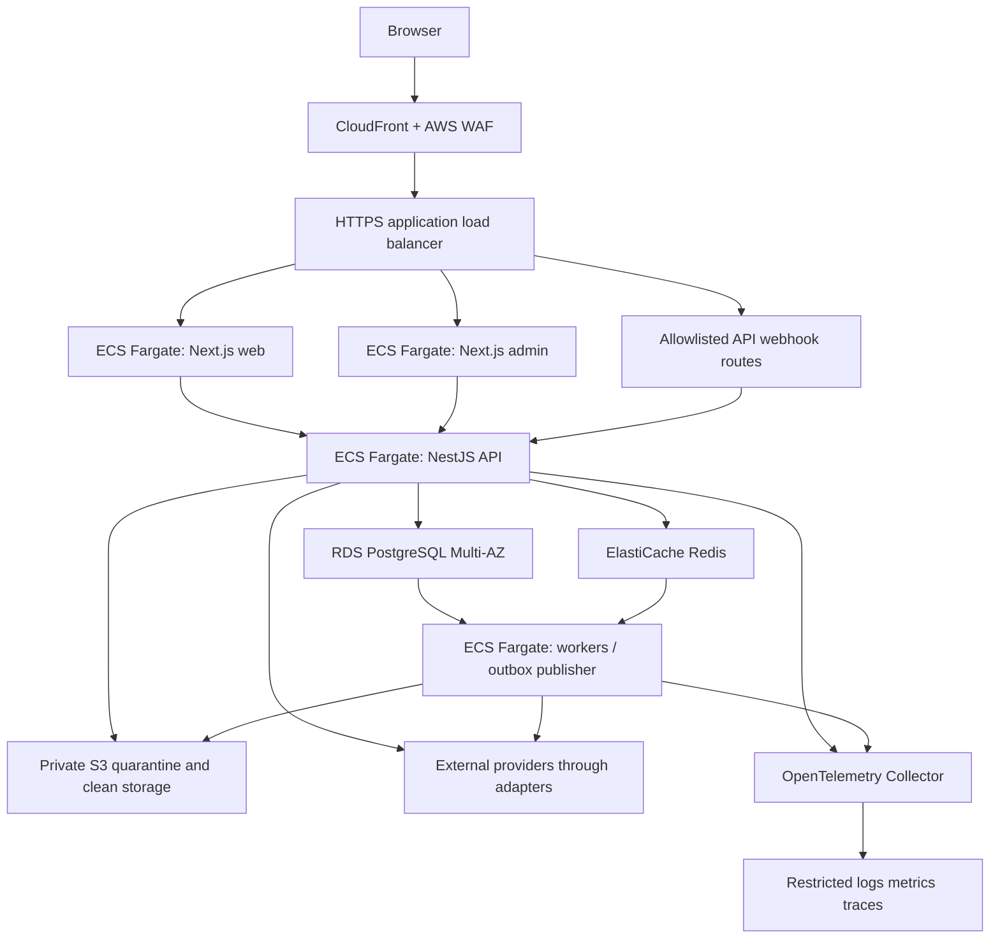

# Infrastructure

Status: frozen architecture specification. Phase 0 creates no AWS resources, Terraform state, container images, production secrets or provider accounts. See [deployment architecture](DEPLOYMENT_ARCHITECTURE.md) and [CI/CD](CI_CD.md).

## Target topology

Web and admin reverse-proxy same-origin `/api` requests to NestJS; authentication cookies remain host-only and server session validation is solely API-owned. No Next.js database access, duplicated business rules or alternative Server Action authority. Provider webhook routes reach API through a separate ingress route with signature verification. External browsers have no direct network path to PostgreSQL, Redis, private worker or collector. Object transfer follows short-lived scoped authorization in [data-room security](DATA_ROOM_SECURITY_MODEL.md); the diagram does not imply public S3 access.

## AWS responsibilities

| Component | Frozen responsibility / isolation |
|---|---|
| CloudFront | Public assets and explicitly public listing projection only; authenticated API/HTML bypass shared caching with `Cache-Control: no-store`; allowlist cache keys; no private document origin |
| AWS WAF + ALB | TLS ingress, managed/application rules, request/body limits, rate limits; ALB origin access restricted to intended edge and controlled webhook entry; WAF is supplementary to API validation |
| ECS/Fargate | Separate web/admin/API/worker services with independent autoscaling and task IAM roles; non-root containers, read-only root filesystem where feasible, no privileged runtime; API/worker in private subnets |
| RDS PostgreSQL | System of record; Multi-AZ in production/pre-production, encrypted storage/backups, TLS, private security groups; scoped application/migration identities and connection budgets |
| ElastiCache Redis | Disposable caches and BullMQ transport, private TLS/auth; durable intent remains in PostgreSQL outbox; session loss behavior follows identity policy; no financial system of record |
| S3 | Separate quarantine/clean/evidence buckets or equivalently isolated policies; Block Public Access, versioning, SSE-KMS, lifecycle/legal-hold policy, access audit; approved public media uses separate publication pipeline |
| KMS | Environment/account-isolated keys with domain-sensitive access policies; key rotation and recovery ownership; avoid decrypt permission for UI tasks |
| Secrets Manager | Environment-unique secrets, provider callback secrets and integration tokens; scoped task access, rotation procedures, never image/build arguments or browser environment |
| ECR | Immutable image digests, signed provenance/SBOM, vulnerability scanning; promotion uses the same digest |
| OpenTelemetry / monitoring | Private Collector and AWS monitoring backend initially; no secrets or raw confidential content; restricted security/audit stores |
| Terraform | Reviewed module plans for network, ECS, DB, cache, storage, security and monitoring; encrypted remote state and locking, per-environment state isolation |
| GitHub Actions | Ephemeral deployment credentials through OIDC and exact repository/ref/environment trust; protected environment approvals for production |

Task roles grant workload access; task execution roles grant ECS image/log/secret initialization access. They must be separate and scoped by service. This follows AWS ECS's documented role separation. [AWS ECS IAM roles](https://docs.aws.amazon.com/AmazonECS/latest/developerguide/security-iam-roles.html)

## Network and tenancy

Use at least two availability zones for production ingress and application capacity. Private service/data subnets accept only security-group-scoped traffic. Restrict outbound provider traffic through controlled egress with URL/IP validation for preview/repository fetching; no public arbitrary fetch endpoint. Repository analysis/malware scanning uses isolated worker permissions, no access to settlement secrets and no arbitrary code execution. TLS is required across external and data-service connections; service ingress is authenticated where trust boundaries warrant it.

AWS account isolation separates production from nonproduction and central security/audit logging. Tenancy inside a deployment is application-enforced RBAC+ABAC and scoped data ownership, not an AWS account per marketplace organization. Test all tenant predicates; opaque IDs do not provide authorization. Region/residency is configured per approved launch jurisdiction; cross-region copies remain disabled until residency and provider requirements are reviewed. One regional deployment initially; multi-region active/active is deferred.

## Required environments

| Environment | Data / infrastructure boundary | Providers / exposure / lifecycle |
|---|---|---|
| local | Developer containers for PostgreSQL, Redis, object emulator; synthetic fixtures; local-only credentials | Fakes by default, explicit sandbox opt-in; no public exposure |
| test | Disposable CI network/container services, unique DB and object namespace per run | Deterministic fakes; integration/sandbox suite separately gated; destroyed after run |
| dev | Shared nonproduction AWS account; dedicated dev DB/cache/buckets/secrets/state | Sandbox providers only; authenticated internal ingress; resettable synthetic data |
| preview | PR-specific service and data namespace with restricted IAM/object scope; untrusted forks receive isolated no-secret tests, no privileged deployment | Synthetic fixtures, fake providers by default; access-controlled URL, TTL cleanup; no sharing staging sessions |
| staging | Dedicated account or strong dedicated resources within nonproduction; isolated DB/cache/buckets and secrets from dev/preview | Sandbox providers, production-like architecture, reduced scale; merges and UAT |
| pre-production | Separate release-verification environment/account, production-like topology and recovery controls; synthetic volume | Sandbox providers and controlled fault/performance tests; no real funds or production data |
| production | Dedicated production account(s), isolated state and secrets, Multi-AZ services, restricted admin access | Only approved live provider capabilities after Phase 15 gates; change-controlled and monitored |

Preview namespace isolation must include database ownership/credentials, Redis prefixes or instance separation where ACL isolation is insufficient, bucket-prefix policies, service roles, host-only sessions and collector labeling. Namespace isolation is not permission to share confidential fixtures. Production data is not copied to development; approved irreversible anonymization requires a separate reviewed process and is unnecessary for baseline testing.

## Capacity, persistence and recovery

Initial topology has at least two healthy API and web tasks across availability zones; admin and worker minimums balance availability and critical queue demand. Autoscale on request latency/CPU and queue age with max concurrency bounded by DB connections and provider rate limits. A BullMQ retry is not proof of safe financial replay: replay uses durable operation IDs and reconciles unknown outcomes. Background AI and analysis queues cannot starve settlement or audit publication.

Local Docker specifications and Terraform modules begin in Phase 1; no placeholder manifests are falsely marked deployable. Phase 1 pins supported runtime/library/container versions and records maintenance ownership. Provision only nonproduction infrastructure under the phase authorization; production provisioning requires its own deployment gate. Costs/budgets are monitored by environment, including worker/AI spend, S3 retention and egress; architecture does not imply an unverified cost estimate.
