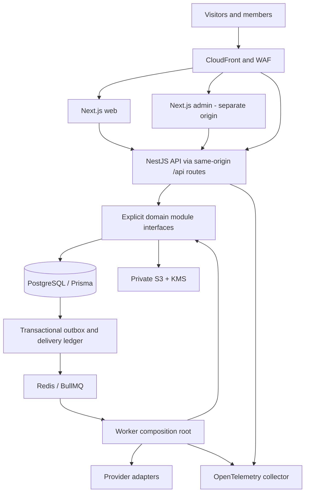

# Dealith master architecture

Status: **Phase 0 architecture baseline**, 2026-09-06. Product authority: [Master scope v1.0](../DEALITH_MASTER_PROJECT_SCOPE.md), §§0–103, preserved unchanged. The current Phase 0 instruction narrows this phase to architecture documentation and verification tooling. [ADR index](adr/README.md) records decisions and deliberate amendments; [Phase 0 report](phases/PHASE_00_REPORT.md) records validation and verdict. “Frozen” means implementation must conform or record a reviewed ADR change; it does not claim implemented controls or production readiness.

## Product and scope

Dealith supports credible verified listings of digital businesses, SaaS, AI/software projects, APIs, mobile applications, developer tools, code/IP, and technology rights. A verified owner publishes; an eligible buyer discovers, evaluates in a Deal Cart, requests scoped confidential access, signs NDA, discusses, negotiates immutable offer revisions, completes diligence, signs an agreement, funds provider-managed escrow, transfers assets, inspects, releases and closes with durable auditable evidence. Founder, seller, buyer, investor and scout are intents that can coexist, not mutually exclusive account classes. Advisors and counsel are explicitly invited participants; organization administration does not imply unrestricted deal access.

Initial architecture covers every domain in [PRODUCT_DOMAIN_MAP](PRODUCT_DOMAIN_MAP.md). Phase 1–15 sequence delivery; a planned domain is not a live feature. Commercial acquisition, code/IP purchase and supported licensing are the initial executable transaction family. DealTypePolicy selects participants, disclosure, templates, required evidence, settlement rail, transfer obligations and completion rules. Initial execution uses positive fiat amounts and fully funded provider escrow. Partnership listings and revenue-share structures remain represented in the model; their execution is disabled until supported legal/settlement policy is approved. Regulated investments and crypto remain default-off by environment, jurisdiction, user eligibility, provider capability and compliance approval. A subscription or frontend flag never authorizes a regulated action.

Excluded in Phase 0: application features, migrations, credentials, deployment and production provisioning. Excluded initially: native custody, seed/private keys, exchange/token/blockchain, arbitrary code execution or Dealith-hosted seller software, public source exposure, autonomous AI transactions, native mobile apps, global securities availability, full accounting ERP and dozens of microservices. Future capability gates are explicit in [phase matrix](PHASE_ACCEPTANCE_MATRIX.md); no unknown provider or jurisdiction is silently assumed supported.

## Container and module architecture



API and worker are two execution processes of one modular backend, sharing domain packages and one versioned data model. Next.js web and admin are separate applications. Stateless containers can scale independently; this is not a microservice estate. PostgreSQL is authoritative for state, financial records, access, sessions, audit and durable event delivery. Redis handles queue scheduling, rate limiting and disposable caches; losing Redis cannot lose an accepted deal command or financial intent. Slow provider/AI/scan/index tasks run in workers; normal APIs return accepted operation IDs without waiting for external execution.

Each module has domain invariants, application commands/queries, exported interfaces, repository adapters, and controller/event adapter layers. Only its repository accesses its tables. Import rules prohibit controllers reaching repositories in other domains and prohibit packages becoming a global service locator. Request-level orchestration calls public application services. Critical multi-aggregate invariants share a transaction context through a narrow coordinator: accepted offer + deal + exclusive reservation; completion + final rights/settlement checks. Every participating service retains ownership of its writes. Eventual side effects include notifications, search indexing and analytics. Security-critical eligibility and funds checks use current authoritative state, not eventually consistent projections.

Future extraction requires an ADR with measured scale/team/compliance motivation, explicit data ownership, versioned RPC/events, backfill/replay, dual-run comparison, cutover and rollback. Provider adapters and workers are natural seams; cross-module database transactions must first become deliberate reservation/process protocols. No promise of free service extraction is made.

## Monorepo and dependency direction

Target only; folders are scaffolded in Phase 1 after this gate:

```text
apps/{web,admin,api,worker}
packages/{ui,contracts,validation,types,events,config,security,observability,eslint-config,tsconfig,test-kit}
prisma/
infra/{terraform,docker,monitoring}
docs/{architecture,adr,product,security,testing,api,runbooks,phases}
```

Use pnpm workspaces with one lockfile and strict TypeScript. `packages/backend` owns shared domain, application and infrastructure modules through documented server-only entry points. `apps/api` owns HTTP composition; `apps/worker` owns worker startup. Both consume the backend package without importing another app's internal source or duplicating business logic. [ADR-002](adr/ADR-002-monorepo.md) fixes this location before Phase 1 scaffolding; it adds the backend package to the target layout above.

`ui` contains accessible presentation primitives with no database/provider dependency. `contracts` owns HTTP schemas and generated client types; `validation` contains pure input value rules; `types` contains minimal universal values, never Prisma entities; `events` owns versioned event schemas. `security` exposes policy primitives and safe redaction, with server-only policy evaluation exports; it grants no browser authority. `config` has separate public/server exports with allowlisted public values. Observability similarly separates browser-safe telemetry from secret-bearing server exporters. Contracts/validation/events must not import backend persistence. Test-kit has synthetic identities and provider fixtures, never production exports. ESLint import restrictions and build graph checks enforce these edges in Phase 1.

## Frontend and API authority

Next.js App Router and React Server Components render public discovery with server-side projected DTOs. Client components own interactive forms, tables and flows. TanStack Query manages remote state and explicit invalidation; React Hook Form plus Zod handles forms; URL parameters own shareable public filters; component state owns transient UI. Avoid a second global copy of domain entities. Tailwind uses shared semantic tokens; Framer Motion is optional for purposeful transitions with reduced-motion support.

Next.js is a rendering/transport layer. Server actions, route handlers and middleware cannot bypass NestJS domain commands or query PostgreSQL. Each origin proxies `/api/v1` to the API so opaque HttpOnly Secure host-only cookies and CSRF controls have an explicit origin boundary. Admin uses a separate session audience and MFA/step-up; a customer session does not authenticate administration. Server render/cache layers must not retain private user responses across requests. No confidential fields in page source, RSC payloads, browser query caches after logout, SEO, analytics, shared CDN or search facets. [API](API_BOUNDARIES.md), [authorization](RBAC_ABAC_MATRIX.md), [UI](UI_INFORMATION_ARCHITECTURE.md) and [design system](DESIGN_SYSTEM.md) define contracts.

## Data, tenancy, authorization and lifecycle

PostgreSQL/Prisma uses module-owned relations, explicit FKs, transaction-local security context, decimal money/currency, UTC instants, non-guessable identifiers, versioned aggregates and immutable evidence/history. Organization ownership is distinct from cross-organization deal participation; personal ownership is explicit, never a null-tenant wildcard. RLS is defense in depth, with no application superuser/bypass role. Authorized participant relationships must be represented so RLS does not deny legitimate buyer/seller access. [DATA_MODEL](DATA_MODEL.md) is the conceptual schema; migration/index design and RLS enforcement are proven with real PostgreSQL in Phase 1–2.

RBAC supplies coarse capability; ABAC checks identity, session assurance, owner/deal membership, current grants, NDA, field classification, evidence, jurisdiction, risk, policy version and feature flags. Default deny; authorization before serialization and signed URL issuance. Owners cannot override mandatory classification or compliance constraints. Emergency administration is time-bound, reasoned and independently audited; no global confidential-document bypass.

Only named commands can traverse the [17-state Project](PROJECT_STATE_MACHINE.md) and [28-state Deal](DEAL_STATE_MACHINE.md) machines. Access, NDA, offers, agreements, settlement and transfer have independent versioned state and evidence. A Deal status is a workflow projection, not proof of payment, signature or document permission. Critical state changes and durable events/audit commit together. Immutable offer revisions, structured LOI/diligence and explicit transfer evidence are specified in [supporting transaction model](OFFER_DILIGENCE_TRANSFER_MODEL.md).

## Integration and sensitive processing boundaries

Provider ports cover identity evidence/KYC, repository access, e-signature, escrow/settlement, AI, email, object storage, search and analytics. Ports normalize capabilities and errors, retain provider references and pin contract versions. Credentials live in Secrets Manager; tokens are encrypted and least-scoped. No hard-coded vendor semantics escape adapters. Unknown external outcomes enter reconciliation, not an assumed success/failure.

[Settlement](SETTLEMENT_ARCHITECTURE.md) owns durable provider intents, signed webhook inbox, deduplication, authoritative reconciliation and financial evidence; providers own custody and movement. [Crypto](CRYPTO_BOUNDARY.md) is a future provider rail only. [VDR](DATA_ROOM_SECURITY_MODEL.md) owns private object versions, quarantine, scanning, classification, expiring authorized access and retention. [AI Gateway](AI_ARCHITECTURE.md) uses permission-filtered evidence, prompt/model versions, redaction, budgets and evaluation; it has no transactional authority. [Repository integration](REPOSITORY_INTEGRATION.md) progressively scopes access and surfaces derived signals. [Preview](PROJECT_PREVIEW_ARCHITECTURE.md) does not execute seller code.

## Reliability and delivery

Transactional outbox provides at-least-once delivery with durable per-consumer receipts; idempotent application effects and provider deduplication target zero financial duplication, not magical exactly-once delivery. Retry budgets, dead-letter handling, trace propagation and replay are in [DOMAIN_EVENTS](DOMAIN_EVENTS.md). Audit is a durable product record, not best-effort logs. Immutable reference history is retained; personal data contents follow purpose-bound retention, legal hold and jurisdiction-approved schedules.

Initial objectives: normal API p95 <400 ms, search p95 <600 ms, server error rate <0.5%, project LCP <2.5 s, core monthly availability 99.9%, zero financial duplication and zero accepted critical audit-event loss. These are targets, not measurements. [Observability](OBSERVABILITY.md) defines measurement and alerting; [infrastructure](INFRASTRUCTURE.md) and [deployment](DEPLOYMENT_ARCHITECTURE.md) define environment/recovery boundaries. [Security](SECURITY_MODEL.md), [threat model](THREAT_MODEL.md), [test strategy](TEST_STRATEGY.md), [E2E matrix](E2E_TEST_MATRIX.md), [CI/CD](CI_CD.md), [DoD](DEFINITION_OF_DONE.md), and [risks](PROJECT_RISK_REGISTER.md) are binding implementation gates.

Phase 0 approves a reviewable architecture. Phase 1 pins compatible runtime/tool versions and builds the smallest deployable platform. No dependency version, vendor coverage, security control, runtime performance or launch approval is asserted without implementation evidence.
